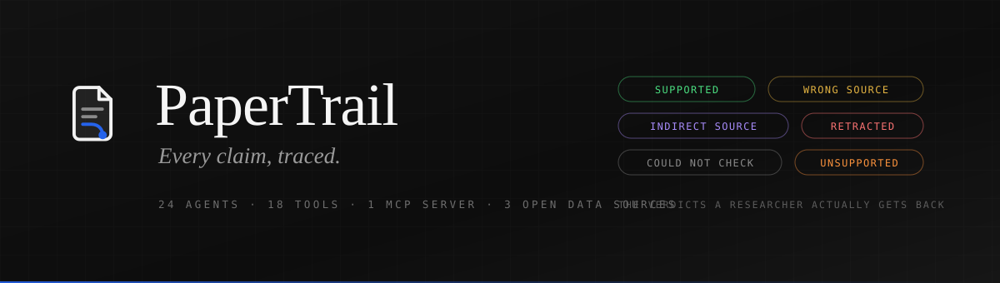
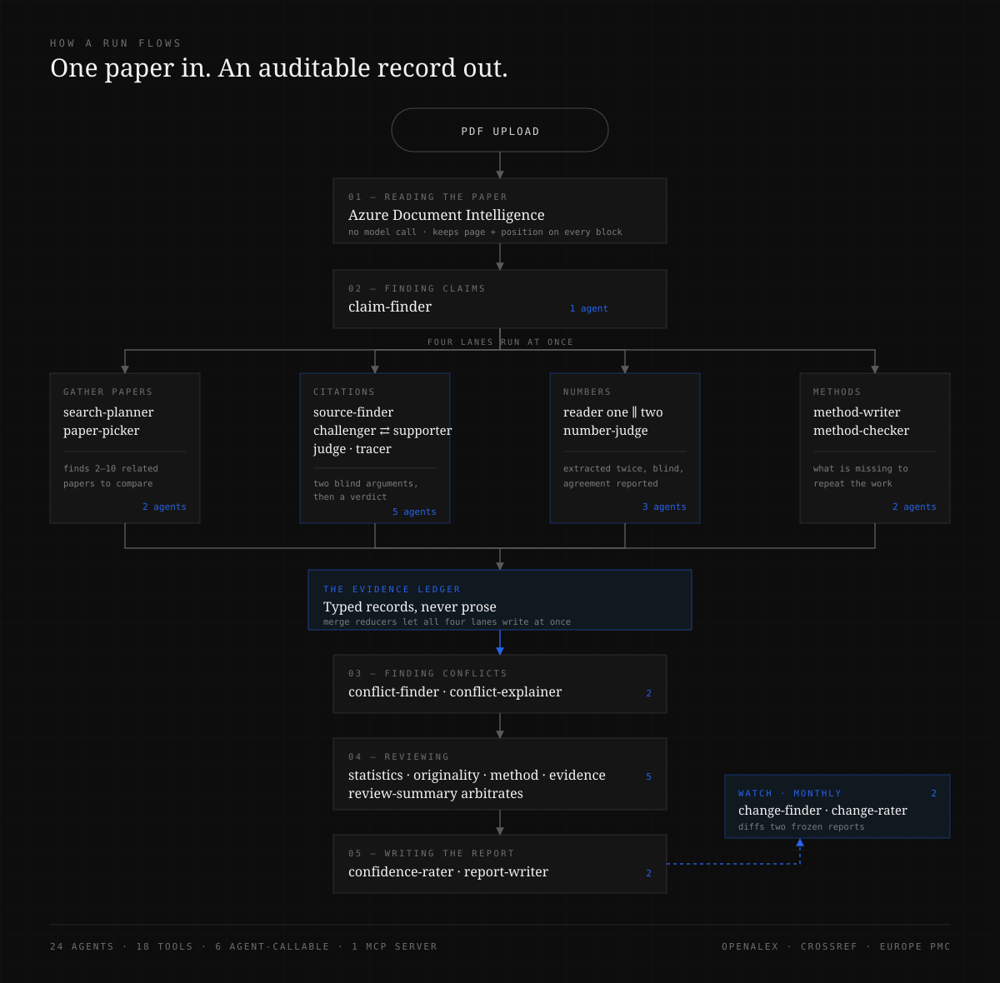

# PaperTrail

**Checks whether a research paper's citations, numbers and methods hold up — then takes your own question from a literature search to a draft you can defend.**

Upload a PDF. Thirty-two specialists read it, follow every citation back to its source, read the reported numbers twice over independently, list what is missing from the method, compare the findings against related work, and produce a report where every conclusion traces back to a page and a quotation.

Then it keeps watching, because evidence moves.

**[Watch the demo](#demo)** · **[Try it signed in](#try-it-yourself)** · **[Test papers](#test-papers)**

---

<a id="demo"></a>

## Demo

An eight minute walkthrough: the problem, the thirty-two agents, both halves of the product running live, and the measured results.

https://github.com/FlemingJohn/papertrail/raw/master/docs/papertrail-demo.mp4

Everything on screen is the real application reading the real database. The narration was written first so the cursor arrives as each sentence lands; nothing is sped up and no frame is staged.

---

<a id="try-it-yourself"></a>

## Try it yourself

A prepared account, already signed up and confirmed:

| | |
| --- | --- |
| **Email** | `judge@papertrail.app` |
| **Password** | `PaperTrail2026` |

It is an ordinary account. The application has no role system, so this sees exactly what any signed-in user sees — there is no separate admin view.

Signed in, there is a checked report waiting (23 citations, 13 with problems) and a finished research project with its openings, proposals, prior-art verdicts and an exported draft.

---

## The problem

A researcher citing a paper is trusting a chain they cannot see.

**Citations drift.** A finding passes through three papers before you cite it, and somewhere along the way a qualifier falls off. The number survives; the conditions do not. Nobody checks, because checking one citation properly means finding the source, reading it, and comparing what it actually says against what the citing paper claims it says. Twenty minutes, per citation.

**Sources get retracted after you cite them.** There is no mechanism that tells you.

**Numbers get transcribed wrong.** Systematic reviews solve this by having two people extract every value independently and adjudicate the differences. That costs weeks of two people's time, so almost nobody outside a formal review does it.

**Methods omit what you would need to repeat the work.** Randomisation, blinding, reagent concentrations, housing conditions. Not maliciously — they are simply assumed.

The common thread: these are all checkable, all tedious, and all skipped. Not because researchers are careless, but because the arithmetic of doing it by hand never works out.

---

## Architecture



---

## How it works

**A PDF becomes structured text with coordinates.** Azure Document Intelligence returns a bounding polygon for every paragraph and table cell. Nothing enters the record without one — provenance is a database constraint, not a nice-to-have.

**One agent finds the checkable statements.** Every sentence that reports a result, states a fact, or draws a conclusion. References and acknowledgements are skipped; they carry nothing to check.

**Four lanes then run at once**, each scoped to only the sections it needs:

| Lane | What happens |
| --- | --- |
| **Citations** | Resolve the reference, check it for retraction, then two agents argue — one that the citation fails, one that it holds — neither seeing the other. A third reads both and rules. A fourth traces the finding back through the papers that repeated it. |
| **Numbers** | Two agents extract every value independently, blind to each other. A judge resolves disagreements from the source text. The disagreement rate is reported, not hidden. |
| **Methods** | One agent rewrites the method as a runnable protocol. A second hunts for what is missing and writes the question to put to the authors. |
| **Related work** | Finds 2–10 comparable papers, deliberately including ones likely to disagree. |

**Everything converges on one typed ledger.** Agents never pass prose to each other — each appends structured records, and merge reducers let all four lanes write concurrently without clobbering. After this point the PDF stops being the source of truth; later stages read the ledger.

**Then conflicts, review, and the report.** Conflicting findings are grouped and the differing factor identified. Four reviewers examine statistics, originality, method and evidence separately; a fifth arbitrates. A confidence rater weights every claim, and a writer produces the summary — including an explicit list of what could not be checked.

### Why more than one agent

Three of these cannot be done honestly by a single reader.

**Citations** are judged by three agents because a single agent asked *"is this citation sound?"* tends to agree with whatever it just read. Splitting prosecution from defence, with a judge who sees both and neither of whom sees the other, removes that.

**Numbers** are extracted twice because that is how systematic reviews have always done it. The agreement rate between two blind readers is a quality measure you can publish; a single extraction gives you no way to know if it is wrong.

**Reviews** come from four specialists looking at one thing each, so a single reviewer's loudest concern cannot crowd out the others.

---

## From a question to a draft

Checking a paper is one half. The other half starts from a question you have not answered yet.

Give it a research question and it gathers the papers, drops the retracted ones before anything is read, maps what the set has already settled, and shows you where the openings are. Then it stops.

**It stops three times, and each stop is a decision only a researcher can make.**

| Gate | What you are shown | What you decide |
| --- | --- | --- |
| **After the gaps** | Every opening, marked *the papers say this* / *read across the papers* / *not backed by the papers* | Which openings are real |
| **After the search for existing work** | Each proposal broken into the statements it depends on, plus the papers that already overlap with it | Which proposal to take forward, or none |
| **After the plan** | The steps, what gets measured, and the single result that would prove it wrong | Whether this would actually test the idea |

Only after the third approval does anything get written.

**The novelty maker proposes; the prior art checker tries to kill it.** The checker is told to assume the work already exists and go looking for it. It reports the count of works it actually searched and the phrases it used, so `nothing found` reads as *these searches, on this database, today* — never as *this is new*. On the two runs behind this repo it refused to claim novelty on all four proposals and returned `close work exists` with 39 and 40 works searched.

**A finding it already exists is a result, not a failure.** It costs an afternoon instead of a month.

**The draft can only cite what survived checking.** The bibliography is assembled in code from sources that passed their citation check; the writer is handed that list and no other. Any key it invents anyway is stripped and replaced with a visible marker rather than left to look real. Every source kept out appears in the draft under *Limits of the search behind this draft*, with the reason.

Figures and tables are described by agents as boxes, arrows and cells — never as markup. The TikZ and the SVG are drawn from that description in code, so a figure cannot contain a coordinate no agent chose. The draft exports as PDF through the browser's print view, and as `.tex` plus `verified.bib` for Overleaf.

---

## What a researcher gets

Every claim comes back with a verdict in plain words — no jargon, no scores to decode:

`Supported` · `Partly supported` · `Not supported` · `Wrong source` · `Indirect source` · `Source not found` · `Retracted` · `Could not check`

That last one matters more than it looks. Roughly half of cited sources sit behind a paywall. Those come back marked **unverified, never wrong**, and every report ends with an explicit account of what it did not cover. A tool that hides its own blind spots earns more trust than it deserves.

| Use it to | Instead of |
| --- | --- |
| Check a paper before you cite it | Trusting a chain you cannot see |
| Check your own draft before submission | Finding out from Reviewer 2, four months later |
| Extract meta-analysis data with an agreement score | Two people, several weeks |
| Get told when a source is retracted | Never finding out |
| Turn a methods section into a runnable protocol | Emailing the authors and waiting |
| Find out an idea already exists, in an afternoon | Finding out in peer review, in a year |
| Start a draft from sources that already passed checking | Assembling a bibliography by hand and hoping |

**On a real run** — *Attention Is All You Need*, 15 pages, quick mode — it found 15 checkable claims, checked 10 citations, flagged 3 as unsupported and 2 whose sources it could not locate, and cross-checked 4 reported numbers across two blind readers. **$0.26, about ninety seconds.**

**Measured accuracy: 11 of 12.** Twelve citations whose correct answer is established independently — real retractions, DOIs that resolve nowhere, claims lifted from a paper's own abstract, claims lifted from a different paper. Run it yourself with `npm run evaluate`; the whole set costs $0.14. The single miss returned `Could not check` rather than guessing, which is the behaviour the verdict vocabulary exists to make possible.

---

## By the numbers

| | Count |
| --- | --- |
| **AI agents** | **32**, one file each |
| **Tools** | **24** — 7 external and document, 17 database |
| Agent-callable tools | 6 (the rest are node-invoked only) |
| **MCP servers** | **1**, exposing the 6 agent-callable tools over stdio |
| Open data sources | 3 — OpenAlex, Crossref, Europe PMC |
| Verdict states | 8 |
| Pipeline stages | 9 for a check, four of them concurrent |
| Human gates | 3, on the question-to-draft path |

Twenty-six of the 32 agents have **no tools at all**. They transform evidence handed to them. Giving a judge the ability to fetch more evidence turns it into a fourth investigator, which is not what the stage needs.

### Measured cost

| | Cost |
| --- | --- |
| Checking one paper, standard depth | **$0.2584** |
| A question taken all the way to a draft | **$0.1068** |

The second figure is the sum of four real runs against live Azure: gathering and mapping six papers ($0.0149), two proposals with 79 works searched between them ($0.0599), the plan ($0.0059), and the draft with its figures, tables and bibliography ($0.0261).

---

## Tech stack

| Layer | Choice |
| --- | --- |
| Orchestration | **LangGraph 1.4** (TypeScript) — typed state, merge reducers, custom event streaming |
| Reasoning | **Azure OpenAI GPT-4o**, strict JSON schema mode on every agent |
| Document parsing | **Azure Document Intelligence** `prebuilt-layout` |
| Framework | **Next.js 16**, React 19, Tailwind 4 |
| Database | **Supabase Postgres** via Drizzle |
| Interop | **Model Context Protocol** SDK |
| Evidence | OpenAlex · Crossref · Europe PMC — all free, all keyless |
| Validation | **Zod 4** — one schema serves the model, the API and the UI |

**No vector database.** At 2–10 comparison papers everything fits in GPT-4o's context window, so retrieval sits behind a single function and can be swapped for pgvector without touching an agent.

**Every external effect is a tool.** No `fetch` and no SQL exists outside `lib/tools/`. One wrapper adds caching, retry with backoff, timeouts, a call log and typed failures. A tool never throws into agent context — it returns a failure the agent can reason about, which is why `Could not check` is a real verdict instead of a crashed run.

---

## Business impact

A systematic review costs **$140,000 and 6–18 months**, most of it spent on exactly the work here: screening, extraction, adjudication.

- **Dual extraction** — the two-person, multi-week step of every formal review, done in minutes with a reported agreement score.
- **Citation checking** — roughly 20 minutes of human work per citation, at **~$0.02 per citation** and no human time at all.
- **Retraction monitoring** — currently nobody's job. Papers built on retracted work stay built on retracted work.
- **Pre-submission review** — catching a power problem before submission instead of after a four-month review cycle.

For journals and funders the same engine is a triage filter. For labs it is a standing check on the literature they depend on.

---

## Novelty

**Adversarial citation judgement.** Not "does this DOI resolve" — two agents argue the case blind and a third rules. The failure mode of LLM fact-checking is agreeing with the text in front of it, and structural disagreement is the fix.

**Citation-chain tracing.** Following a finding back through the papers that repeated it, to see whether a qualifier fell off along the way. This is a documented, unsolved problem in scientific publishing and nothing else does it automatically.

**Dual-blind extraction with a published agreement rate.** Importing the methodological standard of systematic review into an automated tool, and reporting the disagreement rather than hiding it.

**Versioned evidence.** Reports are frozen and content-addressed, so a check three months later compares against what was actually concluded then. `git diff` for scientific consensus.

**Honest degradation as a feature.** Eight verdicts including `Could not check`, an explicit limitations section on every report, and a graph that declines to invent conflicts when it has too few papers to compare.

---

## Running it

```bash
npm install
cp .env.example .env.local     # Azure values; Supabase optional
npm run dev
```

Open `http://localhost:3000/check`. Checking a paper works without a database — only the watchlist needs one.

```bash
npm run mcp                    # expose the lookup tools to any MCP client
```

<a id="test-papers"></a>

## Test papers

Eight open access PDFs live in `../paper/`, deliberately outside this repository so nothing there is ever mistaken for source. All are freely redistributable.

**Machine learning, from arXiv** — numeric markers, dense results tables, reference lists that often carry no DOI. Good for exercising the title-fallback path and for seeing `Source not found` reported honestly.

| File | Paper |
| --- | --- |
| `attention-is-all-you-need.pdf` | Vaswani et al. 2017 — every measured cost figure in the docs comes from this one |
| `adam-optimizer.pdf` | Kingma & Ba 2014 — heavy on stated hyperparameters, stresses the method checker |
| `resnet-deep-residual-learning.pdf` | He et al. 2015 — many results tables, stresses the two number readers |
| `bert.pdf` | Devlin et al. 2018 — long reference list, stresses citation matching at volume |

**Clinical trials, from Europe PMC** — where the tool is strongest. Randomised trials cite journal articles with real DOIs, so source resolution, retraction checking and full text reading all actually fire.

| File | Why it is here |
| --- | --- |
| `raynaud-botulinum-trial.pdf` | 127 KB — the cheapest end to end smoke test |
| `alzheimers-electroacupuncture-trial.pdf` | effect sizes with confidence intervals |
| `lumbar-microdiscectomy-trial.pdf` | explicit randomisation and blinding |
| `parkinsons-acupuncture-trial.pdf` | multicentre, so the conflict finder has something to compare |

Expect more `Source not found` verdicts on the arXiv papers. That is the reference style, not a fault: preprint bibliographies frequently omit DOIs, and a title match below 0.6 confidence is reported as not found rather than guessed at.

---

## Documentation

- [Architecture](docs/architecture.md) — how the 32 agents fit together, and what happens when things fail
- [Setup](docs/setup.md) — Azure deployments, Supabase, first run
- [Reproducibility](docs/reproducibility.md) — models, data sources, measured costs, known limits
- [Deploying](docs/deploying.md) — Vercel, environment values, and the function timeout that matters
